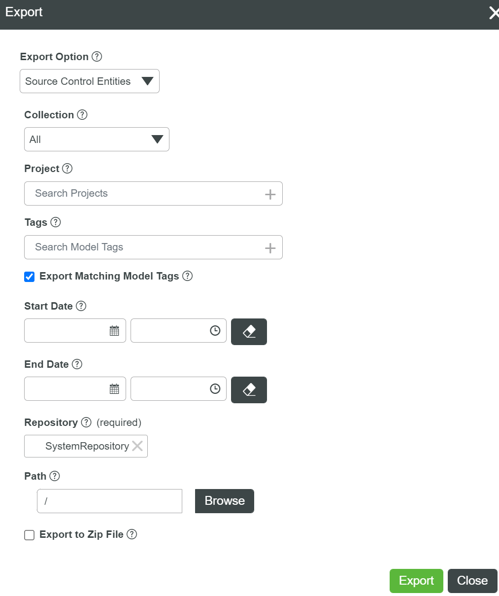
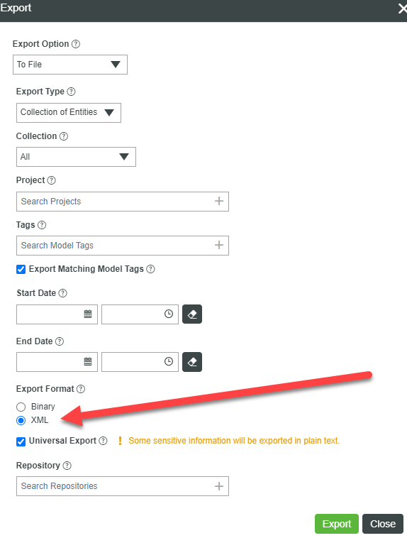
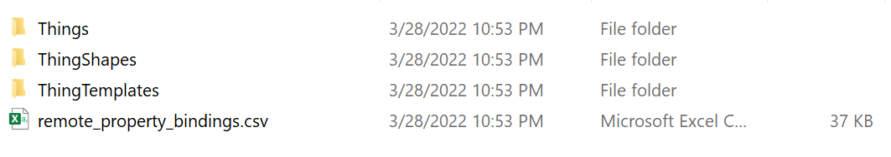

# A mini extractor 

This is a small tool to extract the javascript and sql from the Thingworx XML file. It's very often you have to review a Thingworx design, but it would be very painful to load the design into a new system.

This tool will simply extract the javascript and/or sql script from the `Services` and `Subscription` tabs of all `Things`, `ThingTemplates` and `ThingShape`. 

It can also export all remote property bindings info, aiming for developer to validate the binding tag and `start type`.

## How to use

1. Download the executable file from the release page: [release](https://github.com/xudesheng/twxparser/releases). You can put this executable file in any folder presented in your path.

2. Two ways to export Thingworx design.

    1. Export the content to Source Control Entities:

        

        

    2. Export the XML file from your Thingworx instance
        

3. Execute the following command

    1. When you exported to a folder:

    ```
    twxparser -9 <point to the folder you exported to> -o ./export_rootfolder/
    ```

    `-i` or `--input` indicates the file or folder you want to extract the scripts from.

    `-o` or `--output` indicates in which folder you want to export the scripts to.

    2. When you exported as a whole XML file:

       ```
       twxparser -i <your AllEntities.xml> -e ./export_rootfolder/
       ```

       

## Exported Result:

The exported content includes 3 folders and 1 csv file:




Enjoy! You can post issues or improvement requests [here](https://github.com/xudesheng/twxparser/issues).

